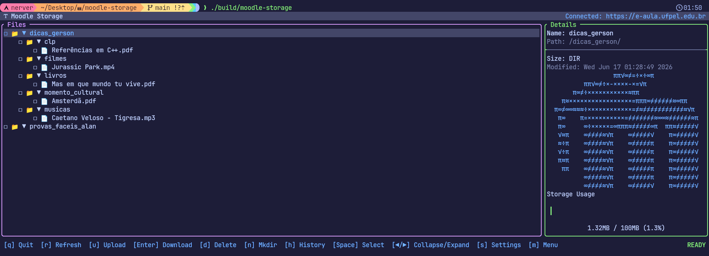
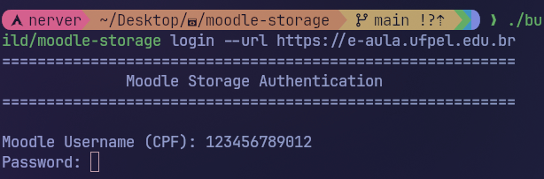
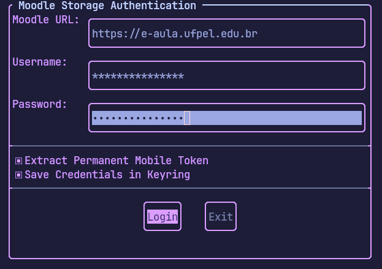
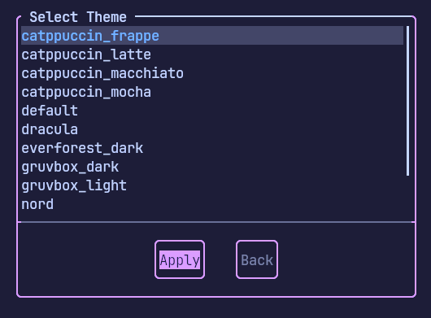

# 🎓 Moodle Storage (mstorage)

```text
    __  ___                ____         _____ __                               
   /  |/  /___  ____  ____/ / /__      / ___// /_____  _________ _____  ___  
  / /|_/ / __ \/ __ \/ __  / / _ \     \__ \/ __/ __ \/ ___/ __ `/ __ \/ _ \ 
 / /  / / /_/ / /_/ / /_/ / /  __/    ___/ / /_/ /_/ / /  / /_/ / /_/ /  __/ 
/_/  /_/\____/\____/\__,_/_/\___/    /____/\__/\____/_/   \__,_/\__, /\___/  
                                                               /____/        
```

   

O **Moodle Storage** é uma ferramenta de linha de comando (CLI) e interface de terminal (TUI) de alta performance escrita em C++23. Ele permite gerenciar a sua área de arquivos privados do Moodle diretamente do terminal, com suporte a uploads recursivos, exclusões em lote e downloads compactados nativamente no servidor.

> 

---

## ✨ Principais Funcionalidades

* 🖥️ **TUI e CLI:** Uma interface gráfica completa no terminal (TUI) para navegação interativa, e uma CLI robusta para scripts e automação.
* 🔐 **SSO Automatizado & Keyring:** Suporte a login automático em Provedores de Identidade (como o Shibboleth da UFPel) sem abrir o navegador, salvando credenciais e tokens em segurança no **Gnome Keyring** (via `libsecret`).
* 🚀 **Arquitetura Híbrida (REST + AJAX):** Combina a velocidade e estabilidade da API REST Oficial do Moodle (Tokens) com o poder cirúrgico da API AJAX legada para operações exclusivas de diretórios.
* 📂 **Gerenciamento Hierárquico:** Criação de pastas (`mkdir -p`), upload recursivo (`-r`), deleção limpa de árvores de diretórios e download em lote (compactação ZIP via servidor).
* 📊 **Observabilidade:** Acompanhamento de cota (Usage) e banco de dados SQLite local com histórico completo de uploads.

---

## 🛠️ Requisitos e Instalação

### Dependências do Sistema

O projeto utiliza bibliotecas modernas em C++ e exige alguns pacotes no sistema operacional.

**Ubuntu / Debian:**

```bash
sudo apt-get update
sudo apt-get install build-essential cmake pkg-config libcurl4-openssl-dev libsqlite3-dev libssl-dev libsecret-1-dev
```

**Arch Linux:**

```bash
sudo pacman -S base-devel cmake pkgconf curl sqlite openssl libsecret
```

### Compilando o Projeto

O projeto usa o `CPM` para gerenciar as dependências de C++ (FTXUI, CPR, nlohmann/json, CLI11, spdlog, GTest) automaticamente.

```bash
git clone https://github.com/seu-usuario/moodle-storage.git
cd moodle-storage
cmake -B build -DCMAKE_BUILD_TYPE=Release
cmake --build build --config Release -j$(nproc)
```

O executável final estará disponível em `./build/moodle-storage`. Recomenda-se criar um alias ou movê-lo para `/usr/local/bin/mstorage`.

---

## 🔐 Setup de Segurança (Gnome Keyring)

O `moodle-storage` não salva suas senhas em arquivos de texto. Ele integra-se nativamente ao sistema de cofres do Linux (Secret Service API).

**Se você usa GNOME, KDE Plasma ou Cinnamon**, o chaveiro (`gnome-keyring` ou `kwallet`) provavelmente já está rodando.

**Para ambientes Window Manager (i3, bspwm, sway) ou Headless:**
Certifique-se de que o daemon do keyring está ativo:

```bash
# Ubuntu/Debian
sudo apt install gnome-keyring dbus-x11 seahorse
# Arch Linux
sudo pacman -S gnome-keyring seahorse
```

*Dica:* O aplicativo `seahorse` (Senhas e Chaves) fornece uma interface gráfica amigável para visualizar e gerenciar os tokens salvos pela nossa aplicação.

---

## 💻 Uso do CLI (Linha de Comando)

A CLI do `mstorage` foi desenhada para facilitar a integração em scripts de shell.

### 1. Autenticação

```bash
mstorage login --url https://e-aula.ufpel.edu.br
```

> 

O CLI pedirá seu CPF e senha de forma mascarada. O processo navega pelos redirecionamentos SSO (Shibboleth), extrai o Token Móvel Permanente do Moodle, e pergunta se você deseja salvá-lo no Keyring.

Para sair e limpar **completamente** seus dados do cofre criptografado:

```bash
mstorage logout
```

### 2. Navegando e Listando

```bash
mstorage list
```

Exibe uma árvore hierárquica formatada (UTF-8/Emoji aware) de todos os seus arquivos privados e pastas.

### 3. Criando Pastas

```bash
mstorage mkdir MinhaNovaPasta
```

### 4. Upload de Arquivos

Você pode enviar arquivos individuais ou espelhar pastas inteiras recursivamente (`-r`).

```bash
# Upload de arquivos únicos para a raiz
mstorage upload documento.pdf foto.png

# Upload para uma subpasta específica
mstorage upload documento.pdf --path /MinhaNovaPasta/

# Upload recursivo de um diretório local
mstorage upload -r /home/user/meus_arquivos --path /Backup/
```

### 5. Download e Compressão

A ferramenta permite o download arquivo-a-arquivo ou delega a compressão ZIP para o servidor Moodle (extremamente rápido).

```bash
# Baixa um arquivo
mstorage download documento.pdf

# Baixa uma pasta inteira (O Moodle criará um ZIP nativo no backend)
mstorage download -r MinhaNovaPasta
```

### 6. Deleção de Arquivos

Apaga arquivos ou diretórios de forma limpa.

```bash
mstorage delete documento.pdf
mstorage delete MinhaNovaPasta -r
```

*A deleção de diretórios aciona um fallback automático para a API AJAX caso a API REST se recuse a apagar o registro físico da pasta.*

### 7. Observabilidade

```bash
mstorage usage        # Exibe a barra de uso da sua cota (ex: 50MB / 100MB)
mstorage history      # Mostra o histórico local (SQLite) das suas submissões
mstorage history -c   # Limpa o banco de dados de histórico local
```

---

## 🖥️ Uso do TUI (Terminal User Interface)

Se você executar o programa sem nenhum argumento (ou apenas `mstorage`), o modo **TUI Interativo** será iniciado.

> 
> *Login pela TUI*

> 
> **Controles Principais:**

* `Setas (Cima/Baixo)`: Navegar na lista de arquivos.
* `Setas (Esquerda/Direita)`: Expandir ou colapsar pastas.
* `Espaço`: Selecionar múltiplos itens (Multi-select) para download ou exclusão em lote.
* `m`: Abrir o Menu Principal.
* `s`: Abrir o Menu de Configurações (Troca de Temas).
* `u / d / Delete / n`: Atalhos rápidos para Upload, Download, Excluir e Nova Pasta (Mkdir).
* `q`: Sair do aplicativo.

---

## ⚙️ Diretórios de Configuração e Temas

Todo o estado local do usuário é salvo no diretório padrão: `~/.config/mstorage/`.

### Arquivos Base

* `session.json`: Guarda a URL do Moodle e o `username` (As senhas/tokens ficam no Gnome Keyring).
* `uploads.db`: Banco de dados SQLite contendo o audit trail das suas operações de upload.

### Customização de Temas (Themes)

O TUI do Moodle Storage suporta temas dinâmicos. Os temas são lidos de arquivos de configuração em:
`/home/user/.config/mstorage/themes/`

O tema ativo fica salvo em `default.conf` dentro desse diretório.

**Como criar um tema novo:**

1. Crie um arquivo chamado `meu_tema_cyberpunk.theme` na pasta `themes/`.
2. Configure ele seguindo como base os outros temas e salve.
3. Abra a TUI, aperte `s` para acessar as configurações, e selecione o seu novo tema!

> 

---

## 🏗️ Arquitetura Interna

O cliente implementa uma ponte híbrida única:

* **A Abordagem REST:** Consome o endpoint oficial `webservice/rest/server.php`. Garante que operações pesadas (Upload/Download) jamais sofram timeouts por expiração de sessão web.
* **O Fallback AJAX:** Consome o endpoint antigo `repository/draftfiles_ajax.php` usando o "Sequestro de Sessão" via Shibboleth. É invocado cirurgicamente para contornar falhas de arquitetura da API do Moodle (como a incapacidade do REST de excluir diretórios vazios ou usar compressão ZIP server-side).

Para um aprofundamento rigoroso na engenharia reversa do sistema de arquivos do Moodle, leia [A Bíblia da Moodle API](docs/MOODLE_API.md).

---

## 📜 Licença

Distribuído sob a licença MIT. Veja o arquivo `LICENSE` para mais detalhes.
