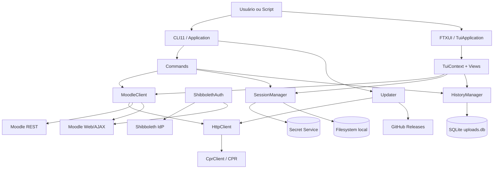
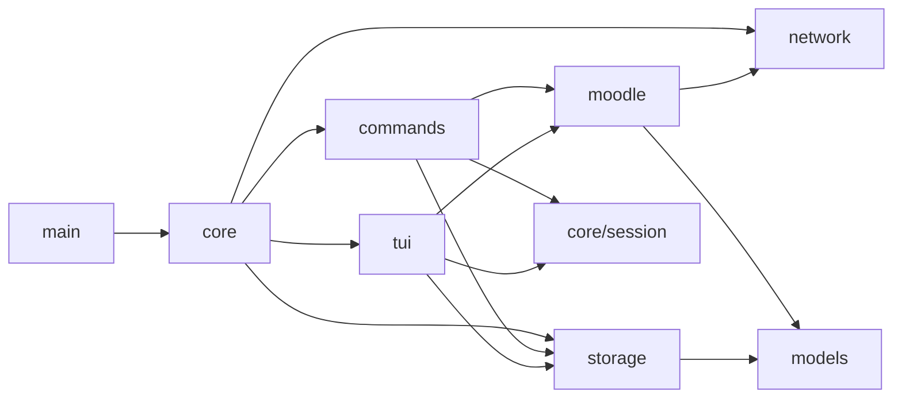
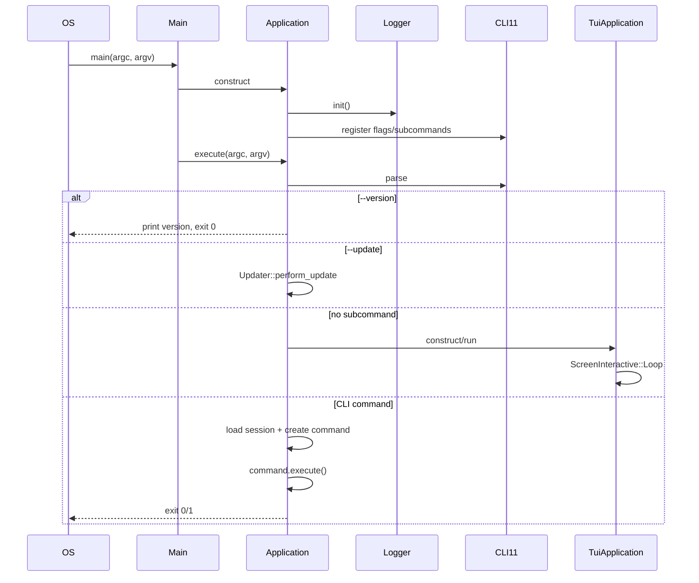
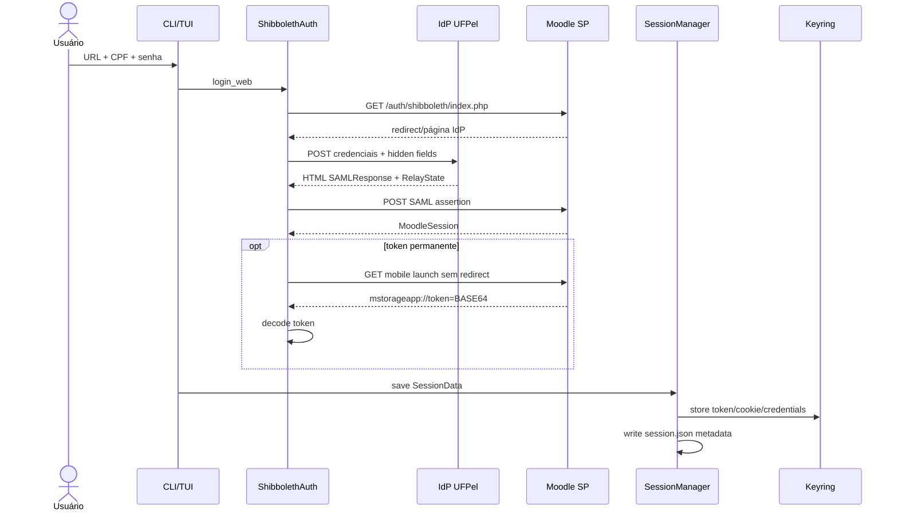
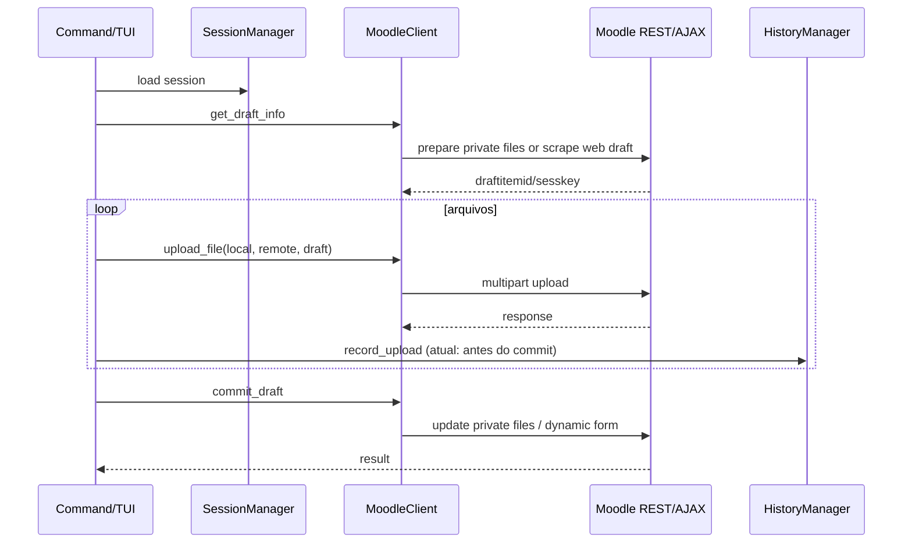
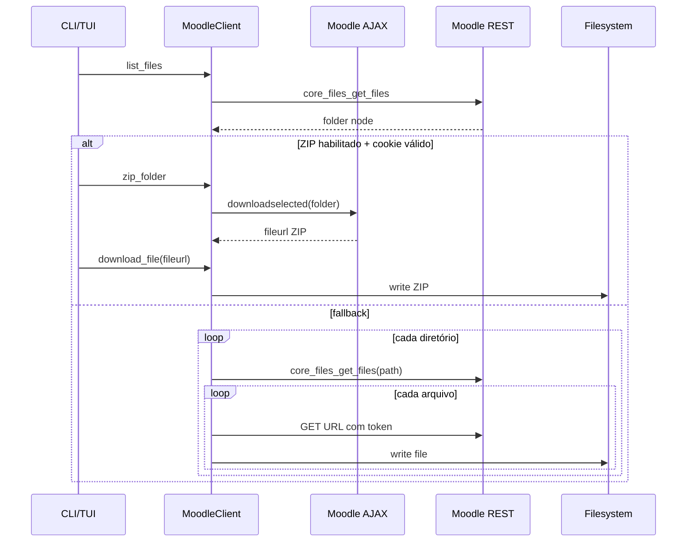
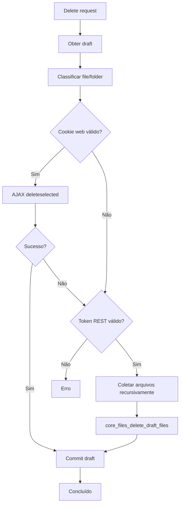
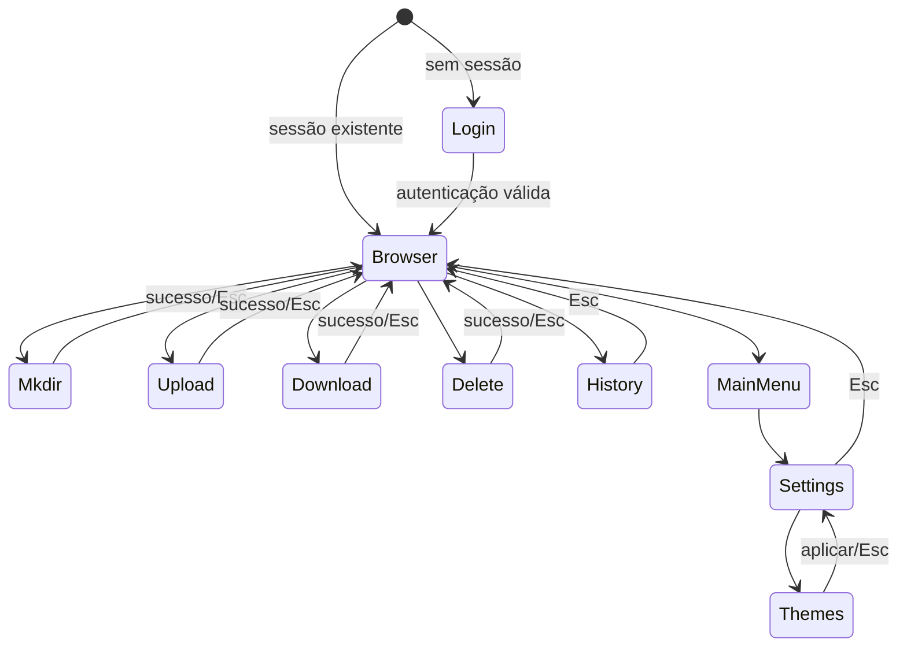
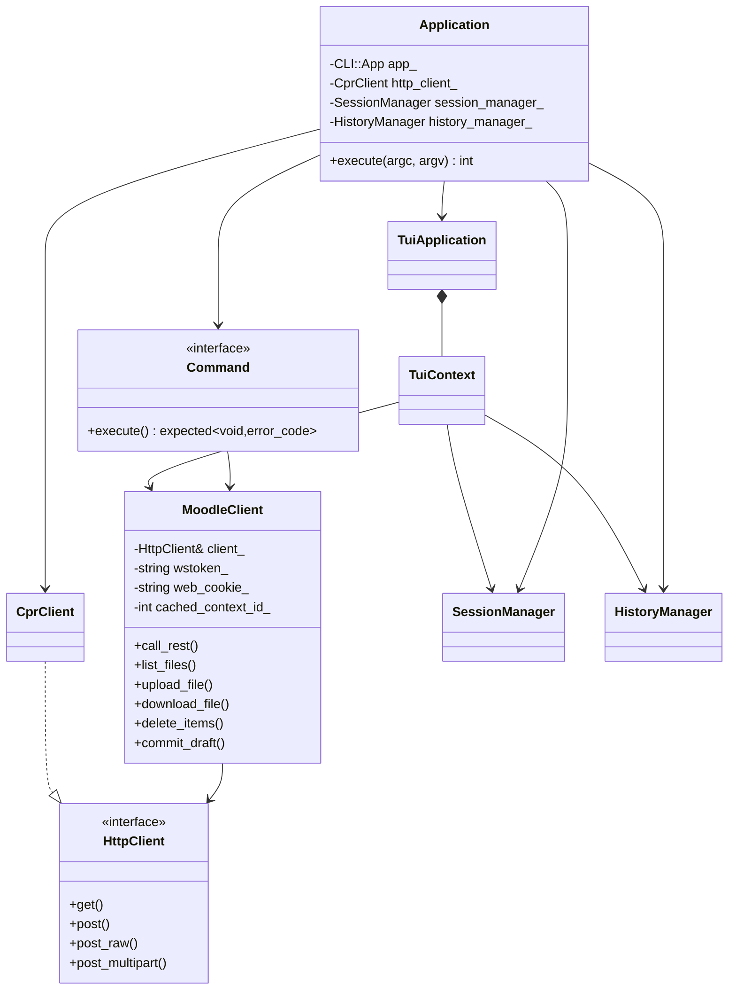
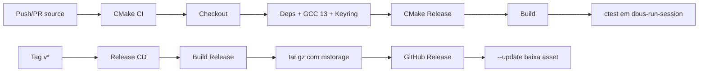

# 9. Diagramas arquiteturais

## 9.1 Componentes em alto nível

## 9.2 Dependências internas

## 9.3 Bootstrap

## 9.4 Login Shibboleth

## 9.5 Upload com draft

## 9.6 Download de diretório

## 9.7 Deleção híbrida

## 9.8 Estado da TUI

## 9.9 Classes centrais

## 9.10 Pipeline de build e release

